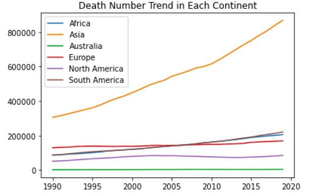
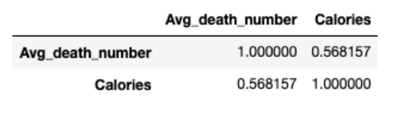

# Global Eating Habits and Diabetes Mortality Analysis
This project explores the potential relationship between continental eating habits and diabetes mortality rates worldwide. Utilizing data scraped from three web sources, I conducted a detailed analysis that includes visualizing dietary patterns, correlating average caloric intake by continent, and examining diabetes-related death statistics.

## Table of Contents
- [Abstract](#abstract)
- [Motivation](#motivation)
- [Data Description](#data-description)
- [Analysis](#analysis)
- [Conclusion](#conclusion)
- [Improvements](#improvements)

## Abstract
This project investigates the impact of continental eating habits on diabetes mortality rates. It involved scraping data from three web sources, visualizing dietary trends, creating a combined dataset of continental average caloric intake, and performing correlation analysis. Despite a positive correlation coefficient indicating that diabetes mortality increases with caloric intake, the analysis revealed no statistically significant correlation, suggesting other factors may also play critical roles in diabetes mortality rates.

## Motivation
With the global rise in diabetes, affecting both the young and the elderly, and its severe complications, this project aimed to explore whether dietary habits across different continents contribute to the variance in diabetes mortality rates. The main cause of diabetes is having too much glucose circulating in your bloodstream. Meanwhile, glucose is one of the main nutrients that provide energy for people, which can get from the foods you eat. People from different cultures of course have different eating habits, Asians eat rice while Europeans eat bread. Will eating habits be a reason for higher diabetes death numbers? I am interested in finding if there is any relationship between people’s eating habits on different continents and the number of diabetes deaths on that continent.

## Data Description

### Data Sources
1. Causes of Death Worldwide (1990-2020): A comprehensive dataset from Kaggle detailing various causes of death globally over thirty years. [View Dataset](https://www.kaggle.com/datasets/ivanchvez/causes-of-death-our-world-in-data)
2. Top 10 Continental Recipes: An article listing the best recipes from each continent, providing insight into regional eating habits. [View Article](https://www.topinspired.com/top-10-best-recipes-from-each-continent/)

3. Recipe Calorie Information: Utilized the USDA FoodData Central API to calculate the average calories of top continental dishes. [USDA API Guide](https://fdc.nal.usda.gov/api-guide.html )

### Data Process
After collecting the initial data, I scraped information on the average number of diabetes deaths per continent and the total calories of the top 10 recipes from each continent. These datasets were then merged to analyze the correlation between dietary habits and diabetes mortality rates. [Merged Dataset](./datasets/combined_data.csv)

## Analysis
Visualization of diabetes deaths from 1990 to 2020 showed significant variations across continents, with Asia experiencing the highest mortality rates. The combined dataset's correlation analysis revealed a p-value of 0.2395, indicating no significant correlation between caloric intake and diabetes deaths, although a positive correlation coefficient suggested a potential increase in mortality rates with higher calorie diets.

## Conclusion
The study concluded that there is no significant correlation between the average caloric intake by continent and diabetes mortality rates, despite a positive correlation coefficient. This suggests that while there may be a relationship between diet and diabetes deaths, it is not solely determined by calorie intake. Future research could improve accuracy by considering cooking methods and other dietary factors.

## Improvements
For more accurate results, future iterations of this project could incorporate detailed analyses of cooking methods and other nutritional information to better understand the relationship between diet and diabetes mortality.